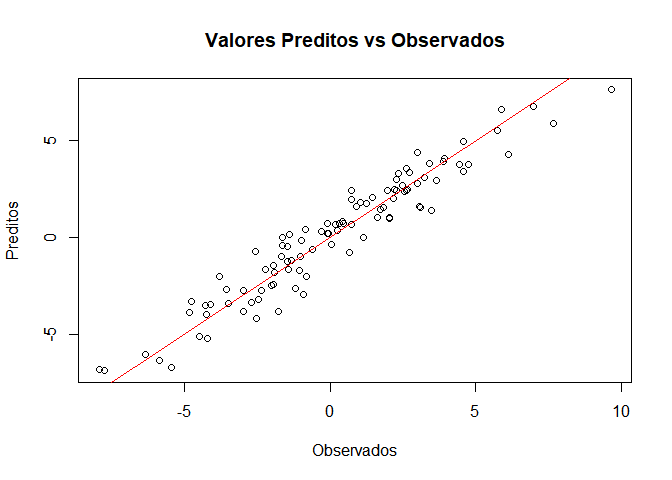

# Pacote de Regressão Linear

Este pacote foi desenvolvido para fornecer ferramentas simples e
eficientes para ajuste de modelos de regressão linear, bem como para
gerar predições a partir desses modelos.

# Instalação

Você pode instalar diretamente a partir do GitHub usando:

``` r
# rode install.packages("devtools") primeiro se você não tiver o pacote devtools instalado.
devtools::install_github("MeyerNicole/RegressaoT2M")
```

# Exemplo de Uso

Aqui está um exemplo básico que mostra como ajustar um modelo de
regressão linear com dados simulados e como fazer predições.

``` r
# Carregando o pacote 
library(Regressao)

# Gerando um conjunto de dados de exemplo
set.seed(123)
x1 <- rnorm(100)
x2 <- rnorm(100)
y <- 3 * x1 + 2 * x2 + rnorm(100)

# Ajustando o modelo de regressão linear
modelo <- regressao_linear(matrix(c(x1,x2), nrow = 100, ncol = 2), y)
```



    #> Intercepto: 0.1350654 
    #> B1: 2.866828 
    #> B2: 2.023811

    # Gerando predições com novos dados
    novos_preditores <- matrix(c(1, 5, 2, 6, 3, 7), nrow = 3, byrow = TRUE)
    predizer_novos_valores(novos_preditores, modelo)
    #> Warning in predizer_novos_valores(novos_preditores, modelo): Predição extrapola
    #> os limites da amostra. Valores preditos podem não ser confiáveis.
    #> Warning in predizer_novos_valores(novos_preditores, modelo): Predição extrapola
    #> os limites da amostra. Valores preditos podem não ser confiáveis.
    #>          [,1]
    #> [1,] 13.12095
    #> [2,] 18.01159
    #> [3,] 22.90223

\#Licença Este pacote está disponível sob a licença GPL (\>=3)
